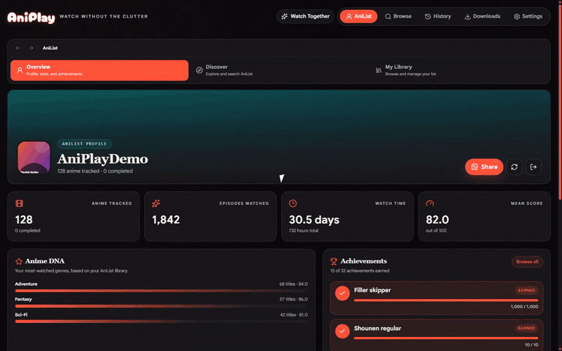

# AniPlay
> ⚠️ Archived

AniPlay is a legacy anime media player project that is no longer
actively developed.

Development has moved to [Kioku](https://github.com/vorlie/kioku),
which provides AniList management and integrates playback directly
through the ani-cli-rs playback pipeline.

This repository is preserved for historical and reference purposes.

---

AniPlay is a Material You-inspired desktop anime browser and player built with Electron, React, TypeScript, and Vite. It combines third-party playback catalogs with AniList discovery, list management, profile statistics, achievements, local watch history, and downloads.

The repository is currently at the 1.17.x line. Windows is the primary supported platform. An Electron Builder Linux target is available for testing, while macOS packaging is not configured.

AniPlay does not host anime or video files. Search results and playback links come from third-party providers, so availability and compatibility can change independently of the app.

[Visit the AniPlay website](https://vorlie.github.io/AniPlayV2/) · [Download the latest release](https://github.com/vorlie/AniPlayV2/releases/latest) · [Join Discord](https://discord.gg/9SXX6ddpNR)



## Features

### Browsing and playback

- Search in compact-list or poster-grid layouts.
- Switch between five playback catalogs:

  | Provider | Catalog | Notes |
  | --- | --- | --- |
  | Anikoto 1 | English sub/dub | Default API/MegaPlay provider; optional experimental AniList-first search |
  | Anikoto 2 | English SUB/H-SUB/DUB | Independent anikoto.cz catalog with multiple embedded-player servers |
  | AniDB.app | English sub/dub | Independent native catalog; may request in-app Cloudflare verification |
  | Desu | Polish subtitles | Polish catalog and supported provider mirrors |
  | Docchi | Polish subtitles | Experimental; adult entries require an explicit settings opt-in |

- Play direct HLS/video sources in the native player or use supported embedded players.
- Switch servers, resolutions, subtitle tracks, and sub/dub mode when the source supports them.
- Picture-in-picture and optional native browser video controls.
- Resume playback from locally stored history.
- Open provider pages in the system browser when AniPlay cannot resolve a compatible in-app stream.
- Provider-specific service notices can warn about outages or compatibility changes.

Source availability, subtitles, native playback, and download support vary by provider and episode.

Contributor documentation for provider workflows is available in [docs/ANIDB-PROVIDER.md](docs/ANIDB-PROVIDER.md) and [docs/ANIKOTO2-PROVIDER.md](docs/ANIKOTO2-PROVIDER.md).

### Torrent streaming

- Choose the magnet action directly on a title in Browse, optionally specify a season, enter an episode, and review Nyaa releases without starting the catalog provider. Torrent remains available from active or unavailable episodes too.
- Review ranked releases before starting anything. Exact episode matches, trusted uploads, seed count, resolution, and codec influence ordering; batch releases provide a file picker.
- Stream MP4, WebM, and M4V files inside AniPlay. Install [mpv](https://mpv.io/) for MKV and other containers unsupported by Chromium.
- See live peer count, transfer speeds, and selected-file progress while watching.
- Configure the cache folder, size limit, deletion policy, bandwidth limits, and mpv path under **Settings -> Downloads**.

Torrent playback is opt-in and never starts as an automatic provider fallback. BitTorrent is peer-to-peer: other peers can see your public IP address, and AniPlay uploads pieces while a torrent session is active. You are responsible for following the laws and content licences applicable in your region. AniPlay does not bundle media, torrent files, trackers, or a Nyaa mirror, and cannot guarantee Nyaa availability or release metadata.

Torrent streams stay on the local machine and cannot be used with Watch Together. The streaming HTTP endpoint binds only to `127.0.0.1` and uses an unguessable session path.

### AniList integration

- Public dashboard with trending, seasonal, and upcoming anime.
- Optional AniList sign-in for personalized lists and recommendations.
- Anime details, descriptions, genres, relations, recommendations, and airing information.
- Add, update, or remove list entries with status, progress, score, and repeat controls.
- Automatic playback-catalog matching with confidence-ranked manual correction.
- Persisted AniList-to-provider mappings and targeted cache invalidation.
- Dedicated profile page with biography, favourites, totals, mean score, watch time, and Anime DNA genre statistics.
- 32 achievements covering library size, completed anime, episodes, total time, discovery, genre-aware goals, and local activity.
- Achievement browser with category and earned/locked filters.
- Locally generated 1200 x 630 profile cards in Hero and Stats styles.
- Related titles and profile favourites open directly inside AniPlay.

AniList activity supplies account-wide statistics. Time-window achievements such as Binge Master, Weekend Warrior, Night Owl, and Golden Week use AniPlay's append-only local viewing ledger and begin accumulating only after the feature is installed.

### Watch Together

- Create ephemeral rooms from an actively playing direct video or HLS source, or join with a ten-character room code.
- Synchronize host play, pause, seek, episode, and sub/dub changes while each participant resolves their own provider stream.
- See AniList-linked participants and readiness, use bounded room chat, copy `aniplay://watch/<code>` invitations, and reconnect after network interruptions.
- Keep the room beside the player on wide screens, open it as an attached desktop drawer, or expand the compact room bar on narrow windows; the create/join dialog closes once playback coordination begins.
- Transfer control to the longest-connected guest if the host does not return within ten seconds.

Watch Together requires AniList sign-in and a controllable non-embed source. It does not send media URLs, provider headers/cookies, watch history, or AniList OAuth tokens to the coordination service. Guest volume, mute, subtitles, fullscreen, and picture-in-picture remain local.

### Downloads and desktop integration

- Queue downloadable sources as MP4 files through bundled FFmpeg.
- Choose a download folder, monitor progress, cancel or retry jobs, clear finished jobs, and reveal completed files.
- One download is processed at a time; interrupted jobs are retained for retry and partial files are cleaned up.
- Optional Discord Rich Presence with anime, episode, sub/dub mode, artwork, pause state, and remaining time.
- Configurable embedded-player ad blocking from EasyList-only through stricter uBlock-based presets.
- GitHub-backed update checks and in-app update installation for packaged Windows installer builds.
- English and Polish interface languages, custom accent colors, notification sounds, and safe graphics mode.

Portable Windows builds cannot update themselves in place. Download a newer portable release manually. Automatic installation is also unavailable in development and current Linux builds.

## Community and issues

For quick help, provider status updates, and test-build discussion, join the AniPlay Discord:

[discord.gg/9SXX6ddpNR](https://discord.gg/9SXX6ddpNR)

Confirmed bugs and provider breakage should be reported through [GitHub Issues](https://github.com/vorlie/AniPlayV2/issues).

## Requirements

- Node.js `20.19+` or `22.12+` (`22.x` LTS recommended).
- npm, using the lockfile included in the repository.
- Windows 10/11 for the primary development and packaging workflow.
- Git for cloning and normal contribution workflows.
- Optional: mpv in `PATH`, or configured under Settings, for torrent containers Chromium cannot play.

Linux packaging requires the host tools expected by Electron Builder. Linux output is available but receives less coverage than Windows. macOS is not currently configured.

## Install and run

```powershell
git clone https://github.com/vorlie/AniPlayV2.git
cd AniPlayV2\ani-cli-gui
npm ci
npm run dev
```

`npm install` can be used during dependency development, but `npm ci` is preferred for a reproducible checkout.

## Useful commands

Run these from `ani-cli-gui/`.

| Command | Purpose |
| --- | --- |
| `npm run dev` | Start Vite and the Electron application in development mode |
| `npm run build:ui` | Type-check and build the renderer, Electron main process, and preload bundle |
| `npm test` | Run the Vitest suite once |
| `npm run showcase:test` | Build AniPlay and smoke-test every synthetic showcase scene without keeping video |
| `npm run showcase` | Generate the local MP4, screenshots, and tracked README GIF on Windows |
| `npm run lint` | Run ESLint across the project |
| `npm run preview` | Preview the built renderer only; Electron APIs are not available |
| `npm run build` | Build a Windows unpacked directory with Electron Builder |
| `npm run pack:dir` | Explicit alias for a Windows unpacked build |
| `npm run pack:portable` | Build a portable Windows executable |
| `npm run build:release` | Alias for the portable Windows build |
| `npm run pack:linux` | Build Linux AppImage and `tar.gz` artifacts |
| `npm run forge:start` | Build assets and launch through Electron Forge |
| `npm run forge:package` | Create an unpacked Forge package |
| `npm run forge:make` | Create the configured Windows ZIP artifact |
| `npm run sync:ciphermap` | Regenerate developer cipher-map data from `ignore/ani-cli` |

## Build output

- Renderer assets: `ani-cli-gui/dist/`
- Electron main/preload bundles: `ani-cli-gui/dist-electron/`
- Windows unpacked app: `ani-cli-gui/dist/win-unpacked/`
- Portable, installer, and Linux artifacts: `ani-cli-gui/dist/`
- Electron Forge output: `ani-cli-gui/out/`

The first packaging run can take longer while Electron tooling prepares binaries. Windows Defender or other antivirus software can also slow portable executable creation.

## AniList authentication

AniPlay bundles its public AniList client ID, so normal users do not need to configure one. The registered OAuth redirect is:

```text
http://127.0.0.1:42819/anilist/callback
```

Developers and forks can override the client ID:

```powershell
$env:ANILIST_CLIENT_ID = "your-client-id"
npm run dev
```

`VITE_ANILIST_CLIENT_ID` is also recognized for compatibility. No client secret is used or bundled. The account token is encrypted with Electron `safeStorage` and stored in the Electron user-data directory. AniPlay uses Electron's asynchronous credential provider when available, which supports the Secret portal and Secret Service on Linux, and retains compatibility with tokens encrypted by the older synchronous backend.

## Optional environment variables

| Variable | Effect |
| --- | --- |
| `ANILIST_CLIENT_ID` | Override the bundled public AniList client ID |
| `VITE_ANILIST_CLIENT_ID` | Compatibility fallback for the AniList client ID |
| `DISCORD_CLIENT_ID` | Override the bundled Discord application ID |
| `ANIPLAY_SAFE_GRAPHICS=1` | Disable hardware acceleration for the current launch |
| `ANIPLAY_ANIKOTO_NATIVE=true` | Experimentally attempt native MegaPlay source extraction in addition to embeds |
| `ANIPLAY_STATUS_URL` | Override the remote provider-status document URL |
| `ANIPLAY_WATCH_TOGETHER_URL` | Override the Watch Together Worker endpoint at runtime |
| `VITE_WATCH_TOGETHER_URL` | Set the Watch Together Worker endpoint for a release build |

Safe graphics mode can also be enabled persistently in Settings or for one launch with `--safe-graphics`.

## Local data and privacy

AniPlay keeps application state in Electron's user-data directory. In a packaged Windows build this is normally under `%APPDATA%\AniPlay`.

Stored data includes:

- Encrypted AniList authentication token, short-lived API cache, and playback mappings.
- Download queue/history and the selected download directory.
- Torrent consent and settings; cached torrent pieces are stored in the configured local cache directory.
- Ad-block settings, remote-notice state, Discord setting, graphics setting, and synchronized cipher data.
- An append-only `viewing-events.v1.jsonl` ledger and rebuildable `viewing-summary.v1.json` aggregate.
- Renderer preferences and up to 100 resume-history entries in Chromium local storage.

Profile images and AllAnime diagnostic JSON files are generated locally through native save dialogs. AniPlay does not upload them to a separate sharing service.

Normal application features still contact their respective services: playback providers, AniList, GitHub update endpoints, the provider-status endpoint, the optional Watch Together coordination Worker, filter-list hosts, image hosts, and Discord Desktop when Rich Presence is enabled. Opt-in torrent playback also contacts Nyaa for RSS discovery and exchanges torrent data directly with peers.

## Discord Rich Presence

Rich Presence is disabled by default. Enable it under Settings -> Player -> Discord Rich Presence.

- Discord Desktop must be running locally.
- AniList-linked playback can use the anime cover and AniList page.
- Catalog-only playback uses AniPlay's fallback artwork.
- Pausing freezes the remaining-time display; ending or closing playback clears the activity.

## Troubleshooting

### Blank or white window

Enable Settings -> Advanced -> Safe graphics mode and restart. If the UI is inaccessible, launch with either:

```powershell
$env:ANIPLAY_SAFE_GRAPHICS = "1"
npm run dev
```

or pass `--safe-graphics` to the packaged executable. Safe mode disables hardware acceleration.

### Packaged app does not start

Test the unpacked executable first:

```text
ani-cli-gui\dist\win-unpacked\AniPlay.exe
```

For a clean application build:

```powershell
cd ani-cli-gui
npm run build:ui
npm run pack:dir
```

Check Electron main-process output for renderer, provider, or FFmpeg errors.

### Provider or embedded player fails

- Check in-app provider notices.
- Try another provider, server, or sub/dub mode.
- Use the browser fallback when offered.
- If strict ad blocking is active, retry with EasyList-only because aggressive lists can break fragile embeds.
- For AllAnime failures, refresh the cipher map and inspect/export the runtime crypto diagnostics.

JW Player error `233011` means a media request failed its cross-origin credential check; it is not an application-folder permission error. AniPlay leaves iframe-owned media credentials and CORS responses to the provider. If it still occurs, note the selected provider and server, retry with ad blocking disabled, and try another server or network. See the [JW Player error reference](https://docs.jwplayer.com/players/docs/jw8-player-errors-reference).

### AniList secure storage is unavailable on Linux

Seahorse is a keyring manager, but its presence alone does not mean the Secret Service daemon is running, unlocked, and reachable through the current desktop D-Bus session. Confirm that `DBUS_SESSION_BUS_ADDRESS` is set and that GNOME Keyring or KWallet is running in the same graphical session as AniPlay.

For GNOME, Cinnamon, XFCE, and similar desktops, AniPlay can be launched once with Electron's explicit backend selection:

```bash
./AniPlay.AppImage --password-store=gnome-libsecret
```

KDE users can select the matching installed wallet version with `--password-store=kwallet6` or `--password-store=kwallet5`. If an explicit backend works, check the desktop's autostart and PAM keyring integration rather than permanently launching an unlocked keyring by hand. Avoid `--password-store=basic`: Electron documents that backend as plaintext-grade fallback protection.

## Project structure

```text
AniPlayV2/
├─ ani-cli-gui/
│  ├─ electron/          Electron main process, providers, services, downloads
│  ├─ src/               React renderer, pages, components, shared types
│  ├─ public/            Static application assets
│  ├─ scripts/           Maintenance and launch helpers
│  ├─ package.json       Scripts, dependencies, Electron Builder config
│  └─ forge.config.cjs   Optional Electron Forge configuration
├─ ignore/               Local/upstream maintenance inputs and generated snapshots
├─ release-notes.md      Current release notes
└─ LICENSE               GNU GPL v3
```

Tests are colocated with the relevant renderer components and Electron services.

## License

AniPlay is distributed under the [GNU General Public License v3](LICENSE). Third-party notices included with packaged builds are available in `ani-cli-gui/THIRD_PARTY_NOTICES.md`.
